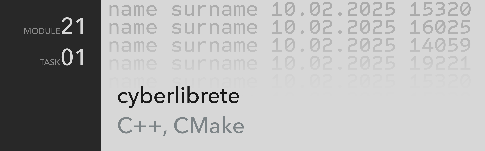

Telegram: [cyberlibre](https://t.me/cyberlibrete)

---
# .task-01
Ведомость учета

## Описание
Программа выполняет основные функции записи и чтения данных из электронной ведомости, которая хранится в виде текстового документа.

В электронной ведомости могут хранится следующие сведения:
- **Имя** *получателя*
- **Фамилия** *получателя*
- **Дата выдачи** *в формате ДД.ММ.ГГГГ*
- **Сумма** *выплаты в рублях.* Допускаются только целочисленные значения

### **Основные команды:**
##### `list`

Выводит список ранее внесенных сведений в файл `report.txt`. Если же файл отсутствует, то программа сообщит о том, что сведений нет.

> Отсутствие файл не приводит к ошибке.

##### `add`
Позволяет добавить новые сведения в имеющийся файл. При отсутствии файла программа создаст новый, в который будет вносить сведения.

Программа поочередно запрашивает необходимые сведения, производит валидацию вводимых данных. После полной готовности программа записывает сведения, которые модно увидеть открыв текстовый документ или введя в программе команду [[#^83fed0|вывода списка сведений]].

> Программа проверяет правильность вводимых данных
> **ДАТА** — *программа позволяет вводит три числа через любой разделитель отличный от цифр.*
> 
> **СУММА ВЫПЛАТЫ** — *программа допускает вводить только целочисленные положительные и отрицательные значения, нулевое значение также допускается.*

### **Дополнительные команды**
##### `help`
Выводит на экран список доступных команд

##### `clear`, `cls`
Обе команды доступны для очистки командной строки
