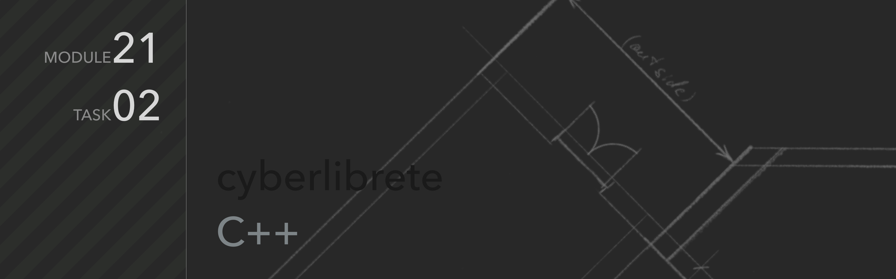

Telegram: [cyberlibre](https://t.me/cyberlibrete)

---
# .task-02
Data model for a village

## Описание
Программа реализует построение подробной модели поселка

**Структура поселка**
- Участок. (Для каждого здания определяются площадь и наличие дымоходной трубы)
    - Жилой дом. (Для каждого этажа определяется своя высота потолков)
        - Этажи (1...3). На этаже должны быть комнаты (2...4)
            - Спальня
            - Кухня
            - Ванная
            - Детская
            - Гостиная
    - Гараж
    - Сарай (бытовка)
    - Баня

Программа поочередно запрашивает данные по участку и ее элементам.

### **Основные команды:**
##### `add`

Инициализирует структуру поселка и ее составные структуры, поочередно запрашивая параметры

> Позволяет дополнять данные к имеющейся структуре

##### `show`

Выводит на экран информацию о структуре и подструктурах и все возможные параметры в виде дерева

### **Дополнительные команды**
##### `help`
Выводит на экран список доступных команд

##### `clear`, `cls`
Обе команды доступны для очистки командной строки в Windows и Unix-системах.

##### `exit`, `stop`
Команды завершают работу программу

> Данные не сохраняются. После завершения программы все данные будут утеряны.
