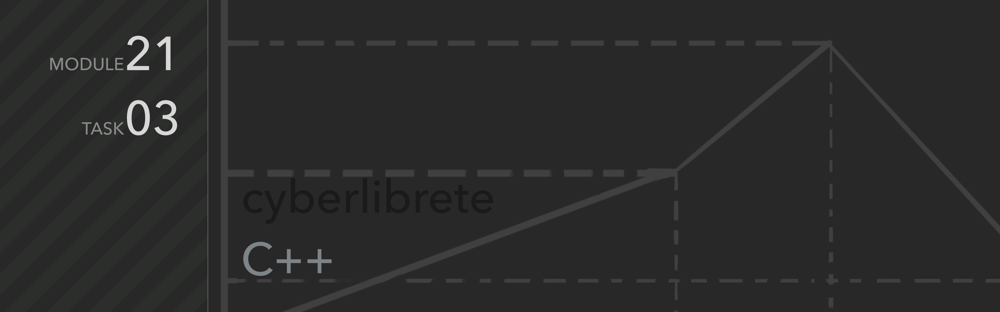

Telegram: [cyberlibre](https://t.me/cyberlibrete)

---
# .task-03
Mathematical vector

## Описание
Программа

### **Основные команды:**
##### `add`
add

### **Дополнительные команды**
##### `help`
Выводит на экран список доступных команд

##### `clear`, `cls`
Обе команды доступны для очистки командной строки в Windows и Unix-системах.

##### `exit`, `stop`
Команды завершают работу программу

> Данные не сохраняются. После завершения программы все данные будут утеряны.
